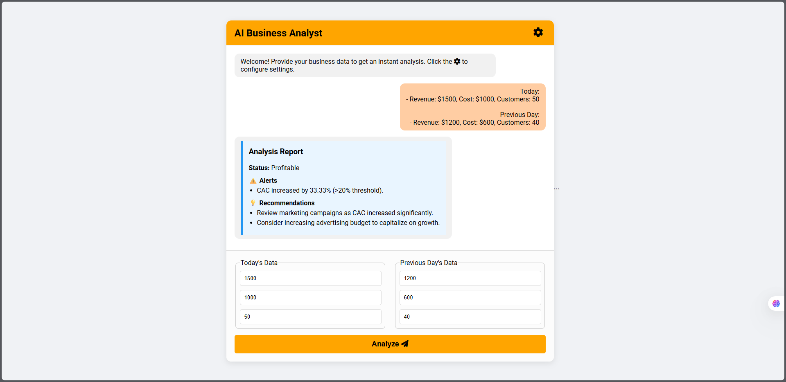
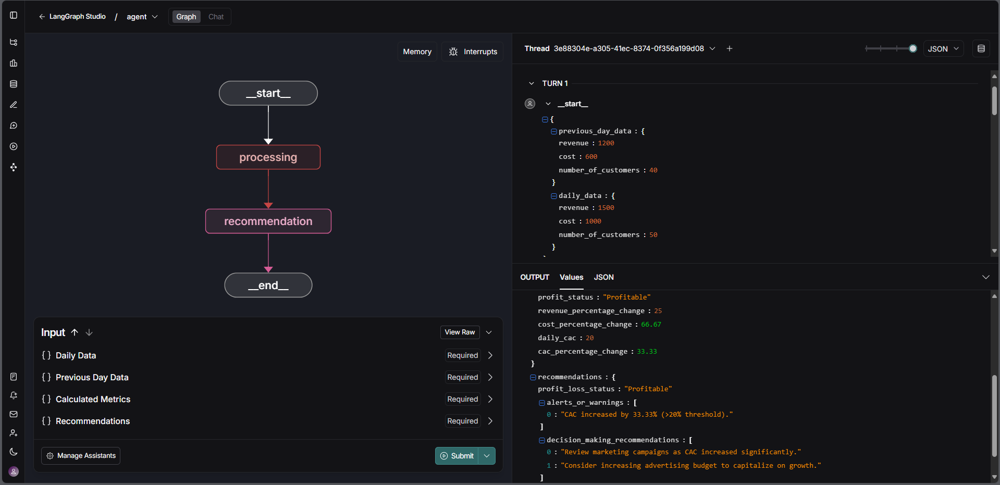
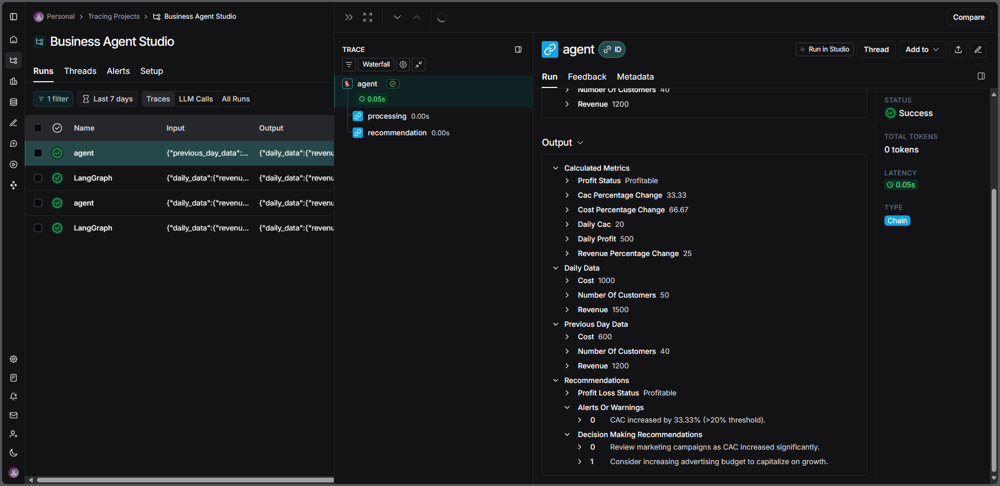

## The Project Studio v0.1




The entire project is organized around the principle of **Separation of Concerns**, which means each file and folder has one clear job. This makes the project clean, professional, and easy to understand.

---

### Visual File Tree

```
STUDIO/
├── app/
│   ├── agent.py
│   ├── server.py
│   ├── static/
│   │   ├── css/
│   │   │   └── style.css
│   │   └── js/
│   │       └── script.js
│   └── templates/
│       └── index.html
│
├── .env
├── config.yaml
└── pyproject.toml
```

---


#### Root Directory Files

These files configure and define the entire project.

*   `pyproject.toml`
    *   **Job:** The project's official **definition and dependency list**.
    *   It tells Python and `pip` what packages your project needs to run (like `fastapi`, `langgraph`, etc.).
    *   This is the modern replacement for `requirements.txt`.

*   `.env`
    *   **Job:** To store your **SECRETS**.
    *   This file holds your `LANGSMITH_API_KEY`. It is designed to be **kept private** and should never be shared or uploaded to GitHub.

*   `config.yaml`
    *   **Job:** To store your **non-secret settings**.
    *   This file holds settings that are safe to share, like the LLM model name or temperature. This allows you to change application settings without touching the code.

---

### The Application Core (`app/`)

This folder is the heart of your application. All the actual program logic lives here.

#### The "Brain" of the Application

*   `app/agent.py`
    *   **Job:** Contains the pure **LangGraph agent logic**.
    *   It defines the agent's state, the `processing_node`, and the `recommendation_node`.
    *   This file is the "brain"—it knows how to do the analysis, but it **knows nothing about the web, FastAPI, or the UI**. It just takes data in and produces a result.

#### The "Public Face" of the Application

*   `app/server.py`
    *   **Job:** The **FastAPI web server**. This is the application's front door.
    *   It creates the API endpoints (like `/analyze` and `/update-settings`) that the user's browser can talk to.
    *   When a request comes in from the UI, this file calls the "brain" (`agent.py`) to get the job done and sends the result back.
    *   It also serves the HTML files to the user's browser.

#### The "Look and Feel" of the Application

*   `app/templates/`
    *   **Job:** Holds the **HTML structure** of your web pages.
    *   `index.html` defines the layout, the input fields, the buttons, and the chat window. It's the skeleton of your UI.

*   `app/static/`
    *   **Job:** Holds the **static assets** that make your UI work and look good.
    *   `css/style.css`: The "paint and style." It defines all the colors, fonts, and animations.
    *   `js/script.js`: The "interactivity." It handles what happens when you click a button, sends the data to the server, and displays the response in the chat window.

---

### How They Work Together: A Simple Flow

1.  You enter data into **`index.html`** in your browser.
2.  You click the "Analyze" button, which triggers a function in **`script.js`**.
3.  `script.js` sends the data to the `/analyze` URL.
4.  Your **`server.py`** (FastAPI) receives the request at the `/analyze` endpoint.
5.  `server.py` calls the agent defined in **`agent.py`** and gives it the data.
6.  **`agent.py`** runs its nodes (`processing`, `recommendation`) and returns the final report.
7.  `server.py` gets the report and sends it back to the browser as a JSON response.
8.  **`script.js`** receives the response, formats it into the nice report card HTML, and displays it in the chat window of **`index.html`**.


---

## LangGraph Studio Integration



### 1. Overview

LangGraph Studio provides a cloud-based, visual interface for the development, debugging, and testing of the agent's core logic. The project is configured to support a "live-sync" development workflow, where changes made to the local source code are instantly reflected in the Studio environment.

### 2. Synchronization Mechanism

The connection between the local development environment and the online Studio is managed by the `langgraph dev` command-line tool.

-   Upon execution, `langgraph dev` reads the project's configuration from `pyproject.toml` and `langgraph.json`.
-   It initiates the local FastAPI server while establishing a secure connection to the LangChain platform.
-   A unique URL is generated and displayed in the console, providing direct access to the agent's graph within the Studio.

This setup enables a hot-reloading feature. Any saved changes to the `app/agent.py` file are automatically detected and synchronized with the Studio instance, facilitating rapid iteration without requiring a server restart.

### 3. Testing Procedure in Studio

1.  **Start the Development Server**
    Ensure the Python virtual environment is activated, then execute the following command from the project's root directory:
    ```bash
    langgraph dev
    ```

2.  **Access the Studio**
    The console will output a startup message, including a link labeled "Studio UI". Access this URL in a web browser.
    ```
    - 🎨 Studio UI: https://smith.langchain.com/studio/?baseUrl=...
    ```

3.  **Provide Input Data**
    The Studio interface will display input fields corresponding to the agent's `BusinessAnalysisState` class. The data must be structured in the correct JSON format.

    -   For the **`Daily Data`** field, toggle the "View Raw" option and input the following object:
        ```json
        {
          "revenue": 1500,
          "cost": 1000,
          "number_of_customers": 50
        }
        ```
    -   For the **`Previous Day Data`** field, toggle "View Raw" and input the following object:
        ```json
        {
          "revenue": 1200,
          "cost": 600,
          "number_of_customers": 40
        }
        ```
    -   The `Calculated Metrics` and `Recommendations` fields should be left as empty objects (`{}`), as they will be populated by the agent during execution.

4.  **Execute the Agent**
    Click the **`Submit`** button located at the bottom right of the interface.

5.  **Analyze the Execution Results**
    The Studio will display the results of the agent run.
    -   **Output Tab:** This panel shows the final state object of the agent after the run is complete. The `calculated_metrics` and `recommendations` fields will be fully populated with the analysis results.
    -   **Graph Tab:** This tab presents a visual flowchart of the agent's execution path (e.g., `processing` node → `recommendation` node). Each node in the graph is interactive; clicking on one reveals its specific inputs and outputs for that step, providing a detailed view for debugging purposes.

### 1. LangSmith: Observability Platform



LangSmith provides comprehensive tracing and monitoring capabilities for the LangGraph agent. It functions as an observability layer, capturing detailed records of every agent execution.

-   **Activation:** The integration is enabled by the presence of `LANGCHAIN_TRACING_V2="true"` and a valid `LANGCHAIN_API_KEY` in the `.env` configuration file.
-   **Functionality:** Each invocation of the agent triggers the creation of a "trace." This trace logs the complete execution flow, including the inputs and outputs of each node, execution times, and any errors that occur.
-   **Utility:**
    -   **Debugging:** Facilitates in-depth analysis of agent behavior to identify and resolve issues.
    -   **Monitoring:** Allows for tracking agent performance, usage patterns, and error rates.
    -   **Evaluation:** Traces can be collected and curated into datasets for regression testing and performance evaluation of future agent versions.

All traces generated by this project are organized under the **"Business Analysis Studio"** project on the LangSmith dashboard.

### 2. LangServe: API Server Framework

LangServe is a library for deploying LangChain and LangGraph objects as robust, production-ready REST APIs.

-   **Implementation:** In the `app/server.py` file, the `add_routes(app, ...)` function integrates LangServe into the FastAPI application. It introspects the compiled LangGraph agent and automatically creates a set of standardized API endpoints at the `/agent` path.
-   **Provided Endpoints:**
    -   **`/agent/invoke`:** A primary endpoint for running the agent with a single input.
    -   **`/agent/batch`:** An endpoint for running the agent on multiple inputs in parallel.
    -   **`/agent/stream`:** An endpoint for streaming outputs as they are generated.
    -   **`/agent/playground/`:** An automatically generated web interface for interacting with the agent. This provides an alternative method for testing the agent's logic, accessible at `http://127.0.0.1:5050/agent/playground/`.

In this project, the custom UI endpoint (`/analyze`) acts as a client to the agent. It receives user data and then calls the agent internally. This architecture decouples the core agent logic from the user-facing presentation layer.


---

## Production Usage Guide (Local Deployment)

The application is served using **Uvicorn**, a standard, high-performance web server for FastAPI applications.

### 1. Prerequisites

Before running the server, ensure the following setup is complete:

1.  **Project Files:** The complete project structure, including the `app` directory and configuration files, must be in place.
2.  **Dependencies:** All required Python packages must be installed from the `pyproject.toml` file into a virtual environment.
3.  **Environment Variables:** The `.env` file must be present in the project's root directory and must contain a valid `LANGCHAIN_API_KEY` to enable LangSmith tracing.

### 2. Execution Steps

1.  **Activate the Virtual Environment**
    Open a terminal in the project's root directory and activate the Python virtual environment.
    ```bash
    # On Windows
    venv\Scripts\activate

    # On macOS/Linux
    source venv/bin/activate
    ```

2.  **Start the Uvicorn Server**
    Execute the following command to start the web server. Note the absence of the `--reload` flag, which is standard practice for a stable deployment.
    ```bash
    uvicorn app.server:app --host 0.0.0.0 --port 5050
    ```

    -   **`uvicorn`**: The command to run the ASGI server.
    -   **`app.server:app`**: Specifies the location of the FastAPI application instance (the `app` variable inside the `app/server.py` file).
    -   **`--host 0.0.0.0`**: Binds the server to all available network interfaces, making it accessible from other devices on the same network (use `127.0.0.1` to restrict access to the local machine only).
    -   **`--port 5050`**: Specifies the port on which the server will listen for requests.

3.  **Verify Server Status**
    The terminal will display output indicating that the server has started successfully.
    ```
    INFO:     Started server process [PID]
    INFO:     Waiting for application startup.
    INFO:     Application startup complete.
    INFO:     Uvicorn running on http://0.0.0.0:5050 (Press CTRL+C to quit)
    ```
    The application is now running as a persistent service.

### 3. Accessing and Using the Application

Once the server is running, the application can be accessed in two ways:

#### A. Custom User Interface (Primary Access)

This is the main entry point for end-users.

-   **URL:** `http://localhost:5050`
-   **Usage:**
    1.  Navigate to the URL in a web browser.
    2.  The full chat interface will be displayed.
    3.  Input the required daily and previous day's business data into the form.
    4.  Click the "Analyze" button to submit the data and receive the agent's report.
    5.  The settings panel remains available for viewing the current configuration.

#### B. LangServe API Playground (For Direct API Testing)

LangServe automatically generates a separate interface for testing the agent's API directly.

-   **URL:** `http://localhost:5050/agent/playground/`
-   **Usage:** This interface allows for sending structured JSON input directly to the agent and viewing the raw JSON output. It is primarily a tool for developers or for integrating the agent with other services.

### 4. Stopping the Server

To stop the application, return to the terminal where the Uvicorn server is running and press `Ctrl+C`. This will gracefully shut down the server process.